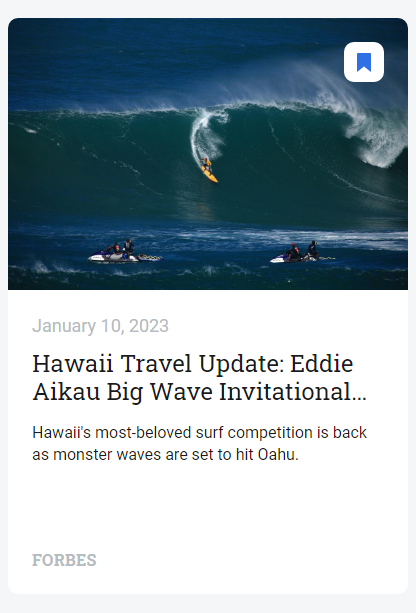
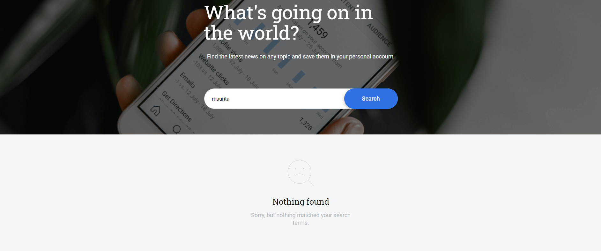

<<<<<<< HEAD
# Final Project at Practicum

# News Explorer Service App 📰🌐🗺️

## **Developed By Chen Abudi** 👩‍💻‍

## 📢 Overview

- Intro
- Technologies & Techniques
- Live Project
- Additional Links
- Possible Improvements
- All Project Features

## 🔎 Intro

This is the Frontend of a News Explorer Service App, where users can search for news articles worldwide and save them to their own accounts. The app developed with React.

## 🛠️ Technologies & Techniques

- ReactJS
- JavaScript
- CSS3
- React Router Dom
- Responsive Layout
- JWT server Auth
- newsapi.org - provides articles news
- Deployed to _`Vercel`_
- CI/CD
- `Vercel Serverless technology`
- Git/GitHub

| NPM Packages (Backend)               |                                                                                                                                                                                                       Aspects of Use |
| :----------------------------------- | -------------------------------------------------------------------------------------------------------------------------------------------------------------------------------------------------------------------: |
| bcryptjs                             |                                                                                                                                                                                                  Password Encryption |
| body-parser                          |                                                                                                                              Returns middlewares that handle incoming requests before they reach a target controller |
| celebrate                            |                                                                                                                                            It's an express middleware function that wraps the joi validation library |
| cors (Cross-Origin Resource Sharing) | It is a mechanism to allow or restrict requested resources on a web server depend on where the HTTP request was initiated. This policy is used to secure a certain web server from access by other website or domain |
| dotenv                               |                                                                                                                              automatically loads environment variables from a .env file into the process .env object |
| express-winston                      |                                                                                                                                    Provides middlewares for request and error logging of your express.js application |
| winston                              |                                                                                                                                                       Universal logging library with support for multiple transports |
| validator                            |                                                                                                                                                                        A library of string validators and sanitizers |
| jsonwebtoken                         |                                                                                                                                   An open standard for securely transferring data within parties using a JSON object |
| express-rate-limit                   |                                                                                                                                Use to limit repeated requests to public APIs and/or endpoints such as password reset |
| helmet                               |                                                                                                                                                   Helps you secure your Express apps by setting various HTTP headers |

## 📍 API Endpoints :

| RESTful API Enpoints | HTTP Methods |                  Usage Purpose |
| -------------------- | :----------: | -----------------------------: |
| /signup              |     POST     |              User Registration |
| /signin              |     POST     |                     User Login |
| /users/me            |     GET      |              GETting user data |
| /articles            |     GET      | GETting data from all articles |
| /articles            |     POST     |         Creating a new article |
| /articles/:\_id      |    DELETE    |    DELETE an article by its id |

---

# _👩‍💻👨‍💻 How to Get Started_

### **Clone**

`$ git clone https://github.com/Chen-Abudi/news-explorer-frontend.git`

### **Install**

`$ cd news-explorer-frontend`

`$ npm i or npm install`

### **Launch**

`$ npm run start`

---

# ✨ Deployed Application

## _Visit the App_ [&#128073;&#127997; **HERE !**](https://news-explorer-frontend-alpha.vercel.app/)

---

## 💎 Valuable Links :

- ## [Backend API](https://news-explorer-api-mu.vercel.app/)

- ## [Backend Repo](https://github.com/Chen-Abudi/news-explorer-api)

## **Enjoy ! 🌺👋🏽**

---

## 📸 Project Features :

- **_Homepage for users before sign up/sign in_**

  

- **_Homepage for user who's logged in_**

  

- **_Sign up_**

  

- **_Sign in/Log in_**

  

- **_Form Validation_**

  

- **_Search results for articles_**

  

- **Articles**

  - **_Marked icon which means the article got saved to profile_**

    

  - **_Remove article from the saved ones_**

    

  - **_When users aren't logged in and wants to save an article, they will need to sign in first_**

    

- **_When there's no match for searching terms, not found results will be shown_**

  

- **_The saved articles page in users account/profile_**

  

- **_Info about the author section_**

  

---

## 🔧 Possible Improvements

- [ ] Create a Forgot Password option in case the users forget theirs.
- [ ] Resets Password
- [ ] Customize news outlet filtration according to user preferences.
- [ ] Customize the sorting of saved articles based on user preferences.
- [ ] Adjust the application for a dark/night mode.

---
=======
# News Explorer - Frontend

## Project Concept

Develop a web application where users can search for news articles from various sources and save them to their user profiles.

---

## Table of Contents

1. [Features](#features)
2. [Front-End Implementation](#front-end-implementation)
3. [Challenges](#challenges)
4. [Design](#design)

---

### Features

The application offers two main functionalities:

1. **Article Search:** Users can enter a keyword into a search bar. The application then sends a request to the News API, finds relevant articles published within the last week, and displays them as a list of cards.

2. **Saved Articles:** A specialized section displays articles that the user has saved, providing a convenient way to revisit them.

---

### Front-End Implementation

#### Pages:

1. **Main Page:** Contains a search box for news article lookup.

2. **Saved News:** Displays all articles that the user has saved or "liked."

#### Popup Windows:

1. **Registration Form:** Allows new users to sign up.

2. **Login Form:** Allows existing users to log in.

#### Reusable Components:

The frontend is built using React. We utilize reusable components and style them according to BEM specifications.

---

### Challenges

1. **Preloader:** Implement a preloader animation that displays while waiting for the News API to respond.

2. **Dynamic Header:** The website header should display differently based on whether the user is logged in or not.

---

### Design

The design mockups are available on Figma [here](https://www.figma.com/file/P64RFFkY2VbDhR51rbscAq/Diploma-WEB-v2.0-EN-US).

For those having trouble with Figma, you can download the `.fig` file [here](download-link).

---

>>>>>>> 74710acca71b6ac8c291ef03f806de9f8a564fe6
